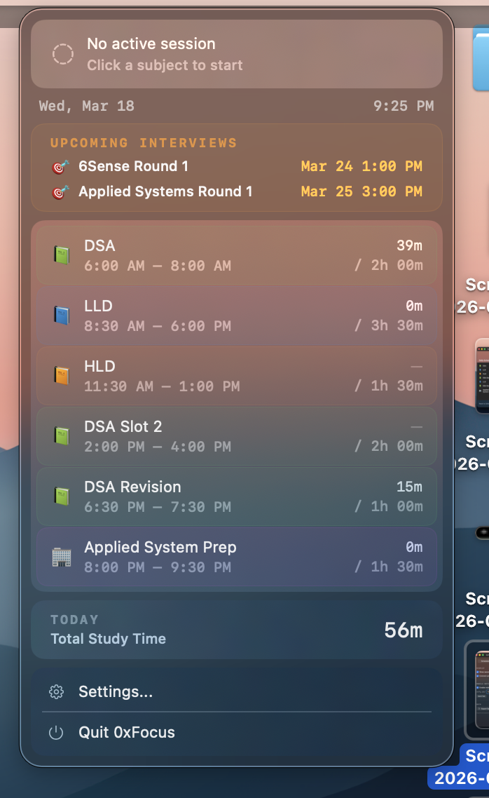
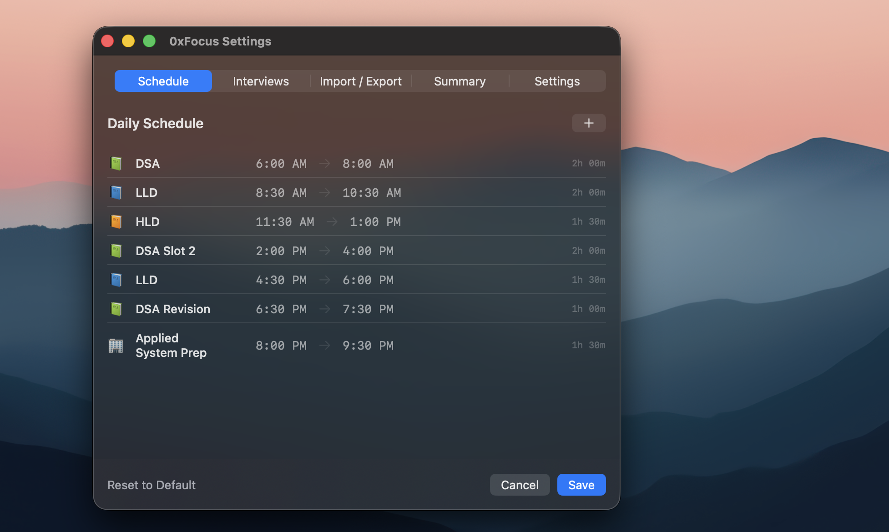

<p align="center">
  <h1 align="center">0xFocus</h1>
  <p align="center">
    <strong>A native macOS menu bar app for engineers grinding interview prep.</strong>
  </p>
  <p align="center">
    Track study hours by subject. Schedule your day. Never miss an interview.
  </p>
  <p align="center">
    <a href="#features">Features</a> &bull;
    <a href="#install">Install</a> &bull;
    <a href="#schedule-format">Schedule Format</a> &bull;
    <a href="#mobile-notifications">Mobile Notifications</a> &bull;
    <a href="#building-from-source">Build</a>
  </p>
</p>

---

> **Note:** This project was entirely vibe-coded in a single session with [Claude Code](https://claude.ai/claude-code). From idea to working app in one conversation. No Figma, no PRD, no sprint planning. Just vibes.

> *"I spent 6 years learning to build software. Then an AI built my side project in one evening while I described what I wanted in broken sentences. I'm not upset. I'm free."*

> *The irony is not lost on me that I built an app to prepare for interviews at companies that are probably building the AI that will make my job obsolete. But hey, at least I'll be well-prepared when I interview at the company that replaces me.*

---

<p align="center">
  
  &nbsp;&nbsp;&nbsp;
  
</p>

---

## The Problem

You're deep in interview prep. DSA in the morning, system design after lunch, company-specific rounds in the evening. You *think* you studied HLD for 2 hours today, but it was actually 45 minutes. You have an interview with Google on Thursday and you keep forgetting to prep for it.

**0xFocus** lives in your menu bar and solves this with one-click time tracking, schedule-aware transitions, and interview countdown reminders.

## Features

### Menu Bar Timer
Start tracking any subject with a single click. The menu bar shows what you're doing and how long you've been at it.

```
📗 DSA  1h 12m / 2h 00m  •  🎯 Google in 2h 30m
```

### Schedule-Aware Transitions
Define your daily schedule. When a block ends:
- Get a notification with sound
- Break countdown appears in the menu bar: `☕ Break 28m → LLD`
- When break ends: notification with **Start** / **Skip** action buttons
- If you keep going past schedule: `⚠️ DSA (overtime) 2h 15m`

### Interview Blocks
Interviews override everything. No breaks, no schedule transitions — just focus.

```
🎯 Interview @ Google  45m 12s
```

- All subject buttons are disabled during interviews
- 24h, 2h, and 30min reminder notifications before each interview
- Upcoming interviews shown in the dropdown with countdown

### AI-Friendly Schedule Import
Generate your schedule with ChatGPT, Claude, or any LLM. Paste it in, click Import. Done.

```
# Daily Schedule
06:00-08:00 DSA
08:30-10:00 LLD
10:30-12:30 HLD
14:00-16:00 Golang
16:30-18:00 Company Prep @ Google

# Interview Blocks
2026-03-20 14:00-15:00 Interview @ Google
2026-03-22 10:00-11:30 Interview @ Uber
```

### Dynamic Subjects
Subjects aren't hardcoded. Whatever you put in your schedule shows up in the menu bar dropdown. "DSA Slot 2", "System Design Revision", "Amazon Prep" — all valid.

### Mobile Notifications
Get push notifications on your iPhone via [ntfy.sh](https://ntfy.sh) (free, no account needed). Block endings, break reminders, interview alerts — all forwarded to your phone.

### Weekly Summary
See total hours per subject for the week at a glance.

## Install

### Download
Download the latest `.app` from [Releases](../../releases).

### Or Build from Source
```bash
# Prerequisites: Xcode 16+, macOS 14+
brew install xcodegen
git clone https://github.com/the-mrinal/0xFocus.git
cd 0xFocus
xcodegen generate
xcodebuild -project 0xFocus.xcodeproj -scheme 0xFocus -configuration Release build
```

The built app will be in `~/Library/Developer/Xcode/DerivedData/0xFocus-*/Build/Products/Release/0xFocus.app`.

## Schedule Format

The import format is designed to be simple enough for humans to write and LLMs to generate:

```
// Lines starting with // are comments (ignored)
// Empty lines are ignored

# Daily Schedule
// Format: HH:MM-HH:MM SubjectName
// Optional: add "@ CompanyName" to tag for a specific company
// Gaps between blocks = automatic breaks
06:00-08:00 DSA
08:30-10:00 LLD
10:30-12:30 HLD
14:00-16:00 Golang
16:30-18:00 Company Prep @ Google

# Interview Blocks
// Format: YYYY-MM-DD HH:MM-HH:MM Interview @ CompanyName
// Interviews override ALL scheduled blocks
2026-03-20 14:00-15:00 Interview @ Google
2026-03-22 10:00-11:30 Interview @ Uber
```

**Pro tip:** Copy the format template from the app (Edit Schedule → Import/Export → Copy Format), paste it into any AI chat, and ask it to generate your weekly schedule.

## Mobile Notifications

0xFocus uses [ntfy.sh](https://ntfy.sh) for free push notifications to your phone:

1. Install the **ntfy** app on your iPhone (free on App Store)
2. Subscribe to a unique topic (e.g., `0xfocus-yourname-secret`)
3. In 0xFocus: Menu bar → Mobile Notifications → enter the same topic
4. Hit **Send Test** to verify

Every notification (block end, break over, interview reminders) is sent to both your Mac and your phone.

## Architecture

```
0xFocus/
├── _0xFocusApp.swift              # App entry, MenuBarExtra setup
├── Models/
│   ├── Subject.swift              # Dynamic subject with auto emoji/color
│   ├── StudySession.swift         # SwiftData model for session logs
│   ├── ScheduleBlock.swift        # Daily schedule block
│   └── InterviewBlock.swift       # Date-specific interview block
├── Services/
│   ├── SessionManager.swift       # Timer, state machine, transitions
│   ├── ScheduleStore.swift        # JSON persistence for schedule/interviews
│   ├── ScheduleParser.swift       # Text format parser/exporter
│   └── NotificationService.swift  # Local + ntfy.sh notifications
├── Views/
│   ├── MenuContentView.swift      # Main dropdown UI
│   ├── ScheduleEditorWindow.swift # Schedule + interviews + import/export
│   ├── WeeklySummaryView.swift    # Weekly hours breakdown
│   └── MobileSettingsView.swift   # ntfy.sh configuration
└── Utilities/
    └── TimeFormatting.swift       # Duration/time formatting
```

**Tech stack:** Swift 6, SwiftUI, MenuBarExtra API, SwiftData (SQLite), UserNotifications, ntfy.sh

**Data storage:**
- `~/Library/Application Support/0xFocus/schedule.json` — daily schedule
- `~/Library/Application Support/0xFocus/interviews.json` — interview blocks
- SwiftData container — session logs (automatic location)
- UserDefaults — preferences (show seconds, ntfy topic)

## Building from Source

```bash
# Requirements
# - macOS 14.0+
# - Xcode 16.0+
# - xcodegen (brew install xcodegen)

# Clone and build
git clone https://github.com/the-mrinal/0xFocus.git
cd 0xFocus
xcodegen generate
xcodebuild -project 0xFocus.xcodeproj -scheme 0xFocus -configuration Debug build

# Run
open ~/Library/Developer/Xcode/DerivedData/0xFocus-*/Build/Products/Debug/0xFocus.app
```

## Vibe Coding Origin Story

This app was built from scratch in a single conversation with Claude Code. No planning phase, no wireframes. The process:

1. Started with "I want a Mac menu bar app to track interview prep hours"
2. Iterated on features through conversation — schedule transitions, break handling, interview overrides
3. Hit bugs, fixed them live, kept shipping
4. Added mobile notifications, AI-importable schedules, and interview countdowns on the fly

The entire codebase was generated, debugged, and refined through natural language. It's not perfect, but it works and it ships. That's the vibe.

### Philosophical Musings from the Grind

- **On the state of software engineering:** I used an AI to build an app that helps me prepare for interviews where they'll ask me to reverse a linked list on a whiteboard. The future is here and it's deeply absurd.

- **On vibe coding:** My grandfather built furniture with his hands. My father built software with a keyboard. I built software by having a conversation. My kids will probably just think about it really hard. Progress?

- **On interview prep:** There's something poetically tragic about spending 200 hours preparing to prove you can do a job you've already been doing for years. But here we are, tracking every minute of it with a menu bar app. At least the app is nice.

- **On building tools instead of studying:** If you're reading this README instead of doing your DSA practice, you're procrastinating. Close this tab. Open LeetCode. I believe in you.

- **On the existential dread:** This app has a weekly summary feature. I recommend not looking at it on Sundays. Some numbers are better left unknown.

## License

MIT

---

<p align="center">
  <sub>Built with vibes and <a href="https://claude.ai/claude-code">Claude Code</a></sub>
</p>
